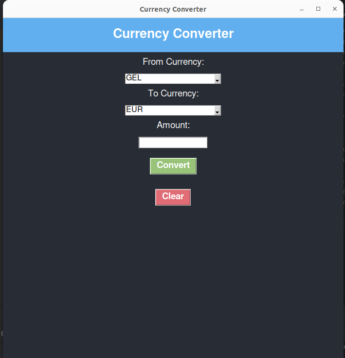

# Currency Converter Desktop Application

This is a simple yet visually appealing desktop application built using Python's Tkinter library. The application allows users to convert amounts between different currencies using predefined exchange rates.

## Features

- **Currency Conversion**: Convert amounts between USD, EUR, and GEL.
- **Dynamic Interface**: Modern and responsive UI using Tkinter's `ttk` module for enhanced visual appeal.
- **Clear Functionality**: Reset the input fields and results with a single click.
- **Error Handling**: Input validation to ensure that users enter valid amounts.

## Technologies Used

- **Python 3.x**
- **Tkinter**: Standard GUI library in Python for creating the graphical user interface.

## Installation and Usage

1. **Clone the Repository**:
    ```bash
    git clone https://github.com/gegasnake/tkinter_currency_app.git
    cd currency-converter-tkinter
    ```

2. **Run the Application**:
    - Make sure you have Python 3.x installed on your system.
    - Run the `currency_converter.py` script using the following command:
    ```bash
    python currency_converter.py
    ```

3. **Use the Application**:
    - Select the currency you want to convert from.
    - Enter the amount to be converted.
    - Select the currency to convert to.
    - Click the **Convert** button to see the converted amount.
    - Use the **Clear** button to reset the fields.

## Contributing

Contributions are welcome! Please fork the repository and submit a pull request if you have any improvements or bug fixes.

## Screenshots



---

### Author

**Gega Tvaradze**  
Aspiring programmer passionate about Python and web development.

Feel free to reach out with any questions or feedback!

---

Thank you for using the Currency Converter Desktop Application! 😊
